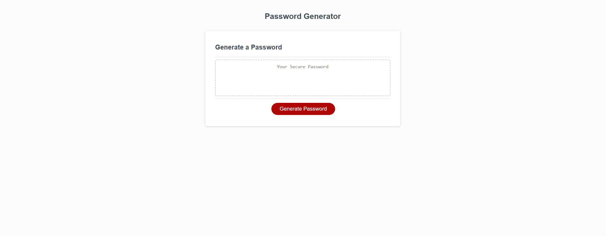

# <Password Generator>

## Description

The application being shown is a password generator using HTML, CSS, and mostly JavaScript. The user will be presented a customized password based off the criteria the user has selected. 

## Installation

No installation required to use the website.

## Usage

Here is the URL to my password generator: https://richard-au1.github.io/Generating-a-Password/ 

Here is the webpage of the password generator. 

Once the red button is clicked the user will be prompted to choose through several criterias to develop their personalized password. There is 5 criterias in total, the first being mandatory containing how long the password should be. While the next 4 criterias are optional for the user to choose from.

After all the criterias have been chosen, the generated password will be shown in the middle of the screen as displayed below. 

Enjoy using my password generator!

## Credits

The mentors I have had along the way.

## License

MIT License

Copyright (c) [2023] [Richard Au]

Permission is hereby granted, free of charge, to any person obtaining a copy
of this software and associated documentation files (the "Software"), to deal
in the Software without restriction, including without limitation the rights
to use, copy, modify, merge, publish, distribute, sublicense, and/or sell
copies of the Software, and to permit persons to whom the Software is
furnished to do so, subject to the following conditions:

The above copyright notice and this permission notice shall be included in all
copies or substantial portions of the Software.

THE SOFTWARE IS PROVIDED "AS IS", WITHOUT WARRANTY OF ANY KIND, EXPRESS OR
IMPLIED, INCLUDING BUT NOT LIMITED TO THE WARRANTIES OF MERCHANTABILITY,
FITNESS FOR A PARTICULAR PURPOSE AND NONINFRINGEMENT. IN NO EVENT SHALL THE
AUTHORS OR COPYRIGHT HOLDERS BE LIABLE FOR ANY CLAIM, DAMAGES OR OTHER
LIABILITY, WHETHER IN AN ACTION OF CONTRACT, TORT OR OTHERWISE, ARISING FROM,
OUT OF OR IN CONNECTION WITH THE SOFTWARE OR THE USE OR OTHER DEALINGS IN THE
SOFTWARE.

